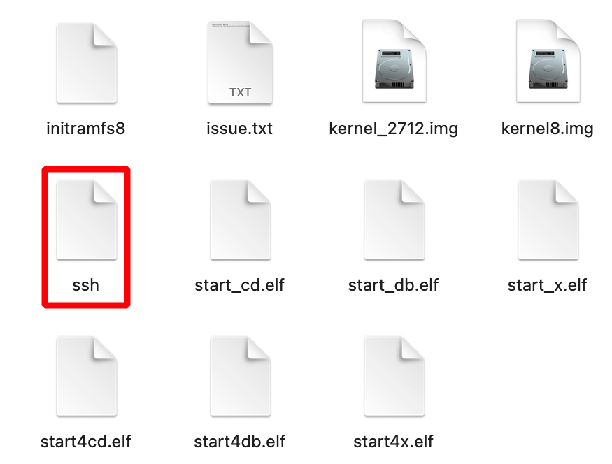

# TBERRYPRINT

## Installation

### Flasher la carte micro SD

1. **Choix de l'OS** : bien prendre Raspberry Pi OS LITE 64bits

  

2. **Paramètre de l'image** :
   * hostname : **tberryprint**
   * user name : **admin**
   * password : **(à choisir)**
   * **Mettre un wifi** (important : au premier démarrage une config du wifi est faite, et je n'ai pas résussi à la reproduire)
   * Pays Wi-Fi : **FR**

  

3. **Fichier ssh** : Penser à ajouter **un fichier vide ssh** après le flash de la clé, pour pouvoir s'y connecter dessus en ssh depuis un autre ordinateur.

  

